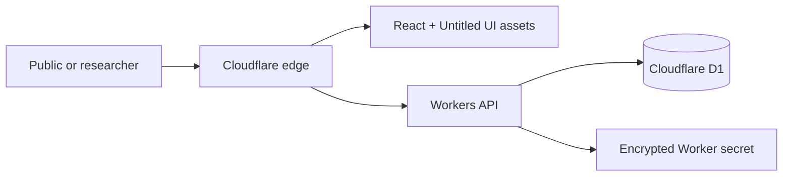

# Nyungwe Nexus

Nyungwe Nexus is a privacy-conscious cloud dashboard for exploring how livelihood support may relate to conservation pressure around Nyungwe National Park. It models the three-arm, 1,800-participant study described by 100WEEKS, African Parks, and Wageningen University & Research.

**Study source:** https://100weeks.org/updates/a-large-scale-study-in-nyungwe-national-park-can-poverty-reduction-contribute-to-nature-conservation

**Live application:** https://nyungwe-nexus.alaara.workers.dev

> All records and outcomes in this repository are synthetic demonstration data. They are not findings from the live Nyungwe study.

## What it does

- compares synthetic income, savings, food-security, livelihood, and forest-use signals across cash-plus, cash-only, and control groups;
- exposes only aggregated participant outcomes and coarse field locations;
- lets authorised researchers record validated field observations;
- exports privacy-safe aggregate CSV data;
- deploys the React application, Worker API, and D1 database as one Cloudflare service.

## Architecture



The frontend uses React 19, TypeScript, Vite, Tailwind CSS, Recharts, and official Untitled UI components. The backend is a Cloudflare Worker with prepared D1 queries, bounded request parsing, security headers, aggregate-only exports, and secret-protected writes.

## Run locally

Requirements: Node.js 22+ and a Cloudflare account for deployment.

```bash
npm install
cp .dev.vars.example .dev.vars
# Replace the placeholder in .dev.vars with a local research key.
npm run worker:dev
```

Open `http://localhost:8787`. To run the frontend alone, use `npm run dev`; API-backed content then requires a Worker proxy or deployed API.

## Verification

```bash
npm run lint
npm run typecheck
npm test
npm run build
npx wrangler deploy --dry-run
```

## Deploy

Create a D1 database once, copy its ID into `wrangler.jsonc`, then run:

```bash
npm run db:migrate:remote
npx wrangler secret put RESEARCH_TOKEN
npm run deploy
```

GitHub Actions workflows are included for pull-request validation and main-branch deployment. Repository secrets required for automated deployment are `CLOUDFLARE_API_TOKEN` and `CLOUDFLARE_ACCOUNT_ID`.

## Documentation

- [Professional report](docs/report.md)
- [10-minute presentation script](docs/demo-script.md)
- [QA report](docs/qa-report.md)
- [200–300-word reflection](docs/reflection.md)
- [CI pipeline](.github/workflows/ci.yml)
- [Initial database migration](migrations/0001_initial.sql)
- [Worker API](worker/index.ts)

## API

| Method | Route | Access | Purpose |
| --- | --- | --- | --- |
| `GET` | `/api/health` | Public | Service health |
| `GET` | `/api/dashboard` | Public | Aggregated dashboard data |
| `GET` | `/api/export.csv` | Public | Aggregated CSV export |
| `POST` | `/api/observations` | Bearer token | Validated field observation |

## Research ethics

The prototype deliberately stores no names, phone numbers, household coordinates, or payment credentials. Participant records use study codes, public observations exclude notes, geography is coarse, and exported results are aggregated. A real study deployment still requires ethics approval, informed consent procedures, a formal data-protection impact assessment, access lifecycle management, and an approved statistical analysis plan.
