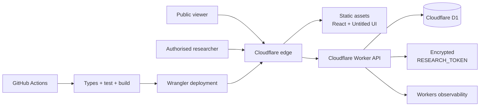
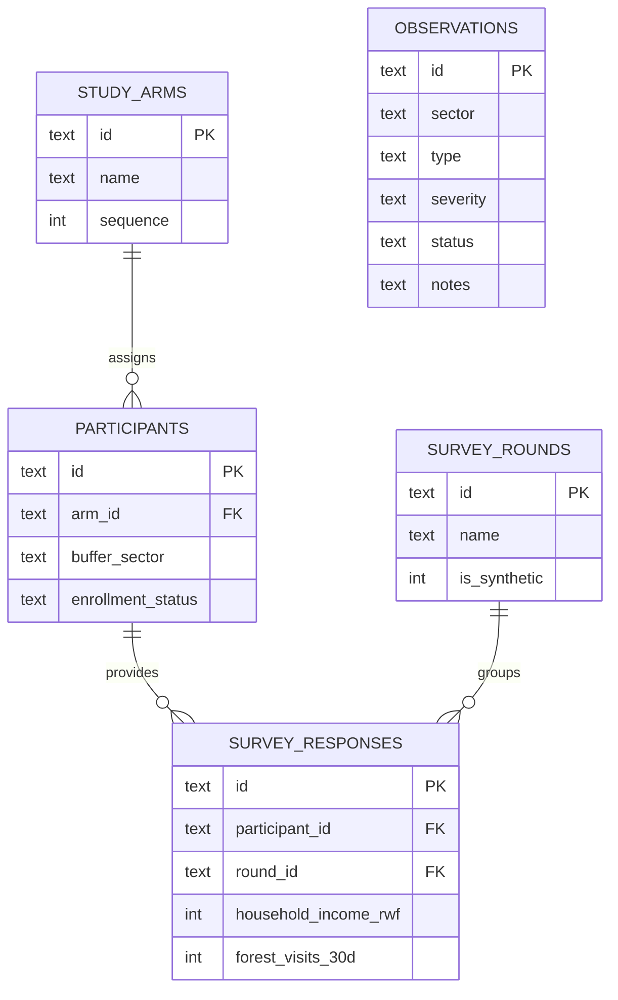

# Nyungwe Nexus: A Cloud-Based Impact Observatory for Livelihood and Conservation Research

**Public deployment:** https://nyungwe-nexus.alaara.workers.dev

**Project type:** Production-oriented academic prototype

**Data status:** Synthetic demonstration data only
**Date:** 1 September 2026

## Abstract

Nyungwe National Park is both an internationally important ecosystem and part of the daily context of households living around its boundary. The study described in the project brief asks whether reducing poverty through unconditional cash transfers, training, and savings groups can also reduce pressure on the forest. This creates an information problem: researchers and conservation partners need to compare livelihood and conservation signals across three randomised groups without disclosing sensitive participant information or presenting preliminary data as causal evidence.

Nyungwe Nexus addresses that problem with a cloud-based impact observatory. It combines a responsive React and Untitled UI dashboard, a Cloudflare Worker API, and a Cloudflare D1 relational database. The demonstrator represents 1,800 coded participants divided equally among cash-plus, cash-only, and control groups. It displays study-level operational counts, aggregated livelihood outcomes, forest-use indicators, and coarse field observations. Authorised users can record a field observation through a validated, secret-protected endpoint; public users can view and export aggregated data only. All included values are explicitly synthetic and must not be interpreted as findings from the active study.

The system is deployed publicly at the URL above. Automated checks cover TypeScript compilation, trust-boundary validation, production bundling, and a Wrangler deployment dry run. The design demonstrates a viable minimum architecture for research monitoring while identifying the governance, identity, statistical, and field-data controls required before real participant data could be introduced.

## 1. Problem definition and context

The supplied project brief describes a collaboration among 100WEEKS, African Parks, and Wageningen University & Research involving 1,800 women living near Nyungwe National Park. Participants are randomised into three groups: a standard 100WEEKS programme combining unconditional cash for 100 weeks with training and savings groups; cash transfers alone; and a control group receiving no programme support during the study period. This structure is designed to distinguish the effect of cash from the additional contribution of training and savings mechanisms.

The ecological context makes the research consequential. In 2023, UNESCO inscribed Nyungwe on the World Heritage List under biodiversity criterion (x). UNESCO describes a 101,900-hectare property in the Albertine Rift containing montane forest, bamboo, peat bog, moor, and grassland environments, more than 95 percent of which were assessed as intact at inscription [1]. The same decision emphasised buffer-zone management and implementation of the 2023–2032 management plan. Conservation is therefore not an isolated park-management issue; it is connected to the opportunities and constraints experienced by communities at the boundary.

Households may use forests for fuelwood, food, materials, or income when alternatives are limited. Yet it would be an error to assume that an income transfer automatically improves conservation. The mechanism could work positively if cash relieves urgent consumption pressure, supports alternative livelihoods, or makes cleaner energy affordable. It could be neutral if forest use is driven by culture, market access, or energy infrastructure. It could even be negative if additional capital enables land clearing. A useful system must preserve that uncertainty instead of encoding a preferred conclusion.

The practical problem is consequently twofold. First, study partners need an understandable operational view across poverty and conservation domains. Second, public communication must not expose women participating in a sensitive randomised trial, reveal precise household locations, or overstate descriptive patterns. Nyungwe Nexus was designed around this combined research, communication, and data-protection need.

## 2. Short literature review

The active Wageningen research record confirms the core intervention logic: it evaluates unconditional cash transfers and a bundle of cash, training, and Village Savings and Loans Associations against livelihood and conservation outcomes near Nyungwe [2]. It also aims to understand the mechanisms that determine whether such interventions can be generalised. That mechanism-oriented objective supports a dashboard that places livelihood and conservation indicators together while keeping the study groups distinct.

The broader evidence does not justify a simple “poverty reduction equals conservation” claim. A rigorous review of cash transfers in low- and middle-income countries covered 165 studies and found progress in intended directions across poverty, education, health, savings, production, work, and empowerment, although the strength of evidence varied by outcome [3]. This establishes cash transfers as a credible poverty intervention but does not establish a conservation effect.

Conservation studies show why evaluation is necessary. Wilebore and colleagues used a randomised controlled trial around Gola Rainforest National Park in Sierra Leone. Their remote-sensing analysis found that unconditional conservation payments increased land clearance in the short run in that setting [4]. This counter-intuitive result is particularly important for the present design: the interface uses neutral language such as “signals,” marks all demonstrator data as synthetic, and avoids labelling differences as impact estimates.

Other interventions have produced different results. A panel evaluation of payment for environmental services programmes in northern Cambodia found reduced deforestation relative to controls. Higher-paying, market-linked programmes also improved participating households’ wellbeing, while a lower-paying biodiversity programme had no detectable livelihood effect. Participation was easier for households that already possessed more capital [5]. The lesson is not that payments always work, but that programme size, design, inclusion, and context mediate both social and environmental results.

A systematic review of payment for ecosystem services located only 11 studies covering six programmes in four countries and described the evidence on poverty and deforestation as limited and methodologically weak [6]. More recent systematic work on land-management interventions similarly argues that environmental and human-wellbeing outcomes are linked, context dependent, and best evaluated together [7]. These findings justify the Nyungwe RCT and shape this application in four ways: group comparisons remain visible; livelihood and forest-use measures appear together; no causal calculation is performed in the operational dashboard; and exports preserve aggregate evidence for authorised analysis elsewhere.

The review also reveals a design risk. Conservation dashboards can turn people into abstract pressure indicators. Nyungwe Nexus counters this by presenting livelihood measures first, using non-stigmatising terminology, and limiting the geography shown publicly. The system is an observatory for a human-and-ecological question, not a surveillance tool for identifying households.

## 3. Scope, stakeholders, and requirements

The principal stakeholders are research investigators, field coordinators, conservation partners, programme managers, participating communities, and public or academic audiences. Their information needs overlap but their access rights should not. For this prototype, the public view provides aggregate study information and coarse operational observations. A research action—recording an observation—requires a secret. Individual survey rows never leave the database through an API.

The minimum functional requirements were:

1. represent the three study arms and 1,800 coded participants;
2. show aggregated livelihood and conservation indicators by arm and round;
3. list recent observations without names, coordinates, or research notes;
4. accept validated field observations from an authorised user;
5. export only group-level CSV summaries;
6. work on mobile and desktop; and
7. deploy through a repeatable cloud workflow.

Non-functional requirements included clear synthetic-data labelling, responsive and accessible interaction, strong validation at the API boundary, prepared database statements, secure response headers, secret management outside source control, observable errors, automated testing, and a design that can scale without maintaining servers. Real payment processing, participant identity management, causal inference, GIS mapping, and offline data collection were deliberately excluded. They are separate high-risk systems and are not required to prove the observatory concept.

## 4. System architecture and technology decisions

The complete deployed system is shown below.

### Frontend

React 19 and TypeScript provide a typed component model for the single dashboard screen. Vite supplies a fast development server and a small production pipeline. Tailwind CSS and the Untitled UI React components provide consistent design tokens, focus behaviour, modal semantics, buttons, badges, form fields, and responsive patterns. The user specifically requested Untitled UI; the implementation uses official version 8 components and icons obtained through the Untitled UI tooling rather than approximating the design system. Recharts renders two concise visual comparisons, while the same values remain available in labelled study-arm cards for users who do not rely on charts.

A single-page dashboard was selected instead of a multi-route portal. The current task has one coherent workflow, so extra routing, state libraries, and client-side data layers would increase maintenance without improving the result. Browser-native anchors, date input, `fetch`, `Intl.NumberFormat`, and React state cover the need.

### Backend and cloud runtime

Cloudflare Workers hosts both the API and the built static assets. A request to `/api/*` runs through the Worker; other requests are served from the asset binding, with single-page fallback enabled. This keeps deployment atomic and avoids cross-origin configuration. Workers scale at the edge without server provisioning, and the runtime starts this application in approximately six milliseconds in the deployment output.

The API deliberately has four routes. `/api/health` supports health checks. `/api/dashboard` batches four prepared D1 queries and returns metadata, outcomes, public observations, and an observation summary. `/api/export.csv` performs aggregate SQL and serialises the result with CSV escaping. `/api/observations` validates and writes an authorised observation. No generic CRUD framework or ORM is necessary for this compact schema; direct prepared statements make the queries visible, typed, and resistant to SQL injection.

### Database model

Cloudflare D1 was chosen because the data is relational: participants belong to one study arm; survey responses belong to one participant and one round; and study-arm comparisons require grouped joins. SQLite constraints enforce valid arm assignment, status values, non-negative financial measures, bounded scores, and unique participant-round responses. Indexes support the query paths used by the dashboard.

The initial migration creates and seeds all tables. A recursive SQL expression generates 1,800 coded records and assigns exactly 600 to each arm. Two synthetic rounds then produce plausible but intentionally artificial differences for UI demonstration. This is more reproducible than checking in a large fabricated dataset and ensures local and remote environments begin in the same state.

## 5. Interaction and user-experience design

The interface is organised around progressive disclosure. The first viewport states the research question and displays a prominent demonstration warning. Four metric cards communicate study scale and operational status. Two charts then show income and forest-visit signals over time. Study-arm cards expose exact synthetic aggregates, and a recent-observations list shows coarse context. The final safeguards panel explains what is deliberately absent.

The visual language adapts Untitled UI to a forest-green brand palette. It uses a persistent desktop sidebar, compact mobile navigation, clear section headings, restrained cards, and status badges. The design avoids wildlife imagery and dramatic claims because the product is a research workspace, not a tourism campaign. Rwandan francs use locale-aware formatting. Mobile layouts collapse to a single readable column, controls have text labels, decorative icons are hidden from assistive technology where appropriate, errors use alert semantics, and form outcomes use a status region.

The observation modal uses native and Untitled UI controls. It asks for a coarse buffer sector, observation type, severity, date, notes, and research key. Guidance explicitly prohibits names and exact locations. The notes field is still treated as private: it is stored for the research workflow but omitted from the public dashboard query. This is a useful example of privacy by interface, API, and query rather than by instruction alone.

## 6. Security, privacy, and research ethics

The prototype follows data minimisation. It does not contain participant names, contacts, exact coordinates, government identifiers, payment records, or household-level public endpoints. Coded IDs are not claimed to be anonymous in a real study; linkage files and rare combinations can re-identify people. A production research deployment would therefore separate identity and research datasets, define retention schedules, restrict administrators, and document lawful and ethical processing.

API writes require a bearer secret stored with Cloudflare rather than in Git. The submitted token and expected token are SHA-256 hashed before a constant-time comparison supplied by the Workers runtime. Request bodies must declare JSON, cannot exceed 8 KiB even when streamed without a content-length header, and are parsed through a strict allowlist validator. The validator rejects unknown sectors, observation types, severities, malformed dates, and notes outside 10–500 characters. D1 prepared statements bind every submitted value.

Responses include a restrictive Content Security Policy, clickjacking protection, MIME-sniffing protection, a referrer policy, and a permissions policy disabling camera, microphone, and geolocation. API responses use `no-store`. Unexpected errors return a generic message while structured server logs record the route and safe error text; observation logs contain only the generated ID, sector, and severity.

One shared secret is an intentional prototype limit, not the recommended final identity model. Before real use, the project needs organisational single sign-on, role-based access, per-user audit events, key rotation, rate limits, abuse monitoring, consent and withdrawal workflows, an incident-response plan, encryption and backup review, and independent security testing. Research ethics approval and community involvement must govern which variables are collected and who sees them. Statistical disclosure controls should also suppress small cells before additional filters are introduced.

## 7. Implementation, testing, and continuous delivery

The repository separates the UI page, Worker handler, validation logic, database migration, and workflows while avoiding speculative service layers. TypeScript checks the browser and Worker projects independently using runtime definitions generated by Wrangler. The smallest high-value automated test targets the observation parser because it is the trust boundary for untrusted writes: the test proves a valid object is accepted and invalid values are rejected.

Verification performed on 1 September 2026 produced these results:

- TypeScript application and Worker checks passed;
- the validation test passed under Vitest;
- the Vite production build completed successfully;
- the D1 migration executed locally and remotely without error;
- a Wrangler dry run validated assets and bindings;
- local and public smoke tests returned HTTP 200 for the health, dashboard, CSV, and application routes;
- an unauthorised observation write was rejected; and
- the public response contained the expected security headers and 1,800 participants across three arms.

The production JavaScript bundle is about 751 kB minified and 222 kB compressed. This is acceptable for the assessed dashboard but is the clearest performance improvement target. If field measurements show slow loading on constrained mobile networks, the charts and observation modal can be split into deferred chunks. That optimisation is deferred until measurement because it would add complexity to a single-screen prototype.

GitHub Actions provides two workflows. CI installs from the lockfile, regenerates Worker bindings, checks types, runs the test, builds the application, and performs a deployment dry run on pushes and pull requests. The deployment workflow repeats the test and build, applies remote D1 migrations, and deploys on the main branch through Cloudflare’s Wrangler action. Cloudflare API credentials remain GitHub secrets. This pipeline makes the build reproducible and blocks broken database or application changes from routine deployment.

## 8. Deployment, scalability, and reliability

The application is publicly available at `https://nyungwe-nexus.alaara.workers.dev`. The production D1 database is located in Cloudflare’s Eastern Europe region and is connected through the `DB` binding. Static files and API logic deploy as one version, while the research key is an encrypted Worker secret. Workers observability is enabled for logs and sampled traces.

The architecture scales horizontally because the Worker keeps no mutable in-memory application state. Every request derives its result from D1 or static assets. Dashboard queries use indexed joins and return six aggregate rows plus small observation lists, so response size does not grow with participant count. D1 batch execution reduces round trips. Cloudflare’s network supplies TLS and edge delivery without a separately managed proxy or virtual machine.

Reliability is improved through constraints, versioned migrations, deterministic seed data, a health endpoint, immutable deployment versions, and generic failure responses. The design does not claim unlimited scale: a future international programme with heavy analytical queries, geospatial rasters, or many concurrent field writes may justify asynchronous ingestion, object storage, and a warehouse. Those components should be introduced only after measured workload or governance requirements exceed this architecture.

## 9. Evaluation, limitations, and next steps

Nyungwe Nexus meets the checkpoint as a deployed vertical slice: it connects a researched problem to an original interface, database model, cloud API, CI workflows, documentation, and a public URL. Its strongest design decision is restraint. It visualises enough information to support discussion while refusing to expose participant-level records or calculate causal effects.

The most important limitation is that all outcome data is synthetic. The system demonstrates capability, not programme success. It also lacks genuine users, usability evidence, multilingual support, offline field capture, formal RCT allocation concealment, missing-data handling, and integration with approved survey or remote-sensing sources. Shared-secret authorisation is suitable for a controlled demonstration but not for a multi-organisation study. The seeded observations are operational examples rather than ecological measurements.

The next phase should begin with governance rather than code. Researchers and community representatives should agree on the minimum indicators, acceptable aggregation thresholds, retention periods, participant communication, and public-release process. A data-protection impact assessment and threat model should follow. Technically, identity can then move to an organisation-managed provider, public aggregates can receive disclosure checks, and real ingestion can be introduced through a staged, auditable import. Usability testing should include field workers on lower-cost Android devices and constrained connections. Only after the statistical analysis plan permits release should the dashboard display real estimates, confidence intervals, attrition, and pre-specified subgroup analyses.

## 10. Conclusion

The relationship between poverty reduction and conservation is plausible, important, and empirically uncertain. Existing evidence includes positive, null, unequal, and adverse outcomes, which makes the Nyungwe randomised study valuable. Nyungwe Nexus turns that research question into a working cloud system without pretending that synthetic signals are results. Its edge-hosted React interface, Worker API, relational D1 schema, validation, privacy controls, observability, automated checks, and public deployment form a robust foundation for an academic prototype. More importantly, its limits are explicit: protecting a World Heritage forest should not require exposing the women whose livelihoods are being studied, and operational software should support rather than pre-empt rigorous analysis.

## References

1. UNESCO World Heritage Committee. (2023). *Decision 45 COM 8B.26: Nyungwe National Park (Rwanda).* https://whc.unesco.org/en/decisions/8407
2. Wageningen University & Research. (2024–present). *Impact of Cash Transfer Bundles Affecting Community Dynamics and Forest Conservations near Nyungwe National Park, Rwanda.* https://research.wur.nl/en/projects/balancing-livelihood-and-conservation-a-randomized-controlled-tri
3. Bastagli, F., Hagen-Zanker, J., Harman, L., Sturge, G., Barca, V., Schmidt, T., & Pellerano, L. (2016). *Cash transfers: what does the evidence say?* Overseas Development Institute / UK Department for International Development. https://www.gov.uk/research-for-development-outputs/cash-transfers-what-does-the-evidence-say
4. Wilebore, B., Voors, M., Bulte, E. H., Coomes, D., & Kontoleon, A. (2019). Unconditional transfers and tropical forest conservation: Evidence from a randomized control trial in Sierra Leone. *American Journal of Agricultural Economics, 101.* https://doi.org/10.1093/ajae/aay105
5. Clements, T., Suon, S., Wilkie, D. S., & Milner-Gulland, E. J. (2014). Impact of payments for environmental services and protected areas on local livelihoods and forest conservation in northern Cambodia. *Proceedings of the National Academy of Sciences.* https://pubmed.ncbi.nlm.nih.gov/25492724/
6. Samii, C., Lisiecki, M., Kulkarni, P., Paler, L., Chavis, L., Snilstveit, B., Vojtkova, M., & Gallagher, E. (2014). Effects of payment for environmental services on deforestation and poverty in low- and middle-income countries: A systematic review. *Campbell Systematic Reviews, 10*(1), 1–95. https://doi.org/10.4073/csr.2014.11
7. Snilstveit, B., et al. (2026). *The effects of land management policies on the environment and people in low- and middle-income countries: A systematic review.* https://pmc.ncbi.nlm.nih.gov/articles/PMC13251849/
